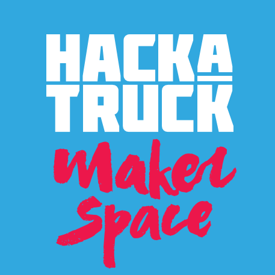

---
# Desafios-HackaTruck-MakerSpace

> Desafios desenvolvidos no HackaTruck MakerSpace UFPA 2026 - Programação Swift <br>
> O HackaTruck MakerSpace é um Projeto em contexto de hackathon com foco em inovação.

<br>

<!-- ===================================================== -->
<!-- HEADER ANIMADO                                        -->
<!-- ===================================================== -->
<p align="center">
  
</p>

<!-- ===================================================== -->
<!-- IMAGEM PRINCIPAL                                      -->
<!-- ===================================================== -->
<p align="center">
  
</p>

<br>

<!-- ===================================================== -->
<!-- TÍTULO                                                -->
<!-- ===================================================== -->
<h1 align="center">
  <span style="color:#00AEEF;">Espaço</span> 
  <span style="color:#00AEEF;">HackaTruck</span> 
  <span style="color:#F7941D;">MakerSpace</span>
</h1>

<br>

<!-- ===================================================== -->
<!-- GRADE DE IMAGENS                                      -->
<!-- ===================================================== -->
<table align="center" width="100%">
  <tr>
    <td align="center" width="33%">
      
    </td>
    <td align="center" width="33%">
      
    </td>
    <td align="center" width="33%">
      
    </td>
  </tr>
</table>

<br>

<!-- ===================================================== -->
<!-- LINK EXTERNO                                          -->
<!-- ===================================================== -->
<p align="center">
  <a href="https://hackatruck.com.br/" target="_blank"
     style="padding:10px 20px; border-radius:8px; border:1px solid #ccc; text-decoration:none;">
    https://hackatruck.com.br/
  </a>
</p>

<hr>

<!-- ===================================================== -->
<!-- BADGES / STACK                                        -->
<!-- ===================================================== -->
<div align="center">

<!-- PROJETO -->


<br>

<!-- STACK -->


<br>

<!-- ARQUITETURA -->


<br>

<!-- GITHUB -->


</div>

<br>

<p align="center">
  
</p>

<br>

<p align="center">
  
</p>

<hr>

<!-- ===================================================== -->
<!-- EQUIPE                                                -->
<!-- ===================================================== -->
### Equipe de instrutores HackaTruck

<table align="center" width="50%">
  <tr>
    <td align="center" width="13%">
      
    </td>
    <td align="center" width="13%">
      
    </td>
    <td align="center" width="13%">
      
    </td>
  </tr>
</table>

<br>

<!-- ===================================================== -->
<!-- CÓDIGO                                                -->
<!-- ===================================================== -->
<hr>
<hr>

```Python
//
//  desafio00App.swift
//  desafio00
//
//  Created by Turma02-10 on 10/03/26.
//

import SwiftUI

@main
struct desafio00App: App {
    var body: some Scene {
        WindowGroup {
            ContentView()
        }
    }
}
```
<hr> 
<hr>

<!-- ===================================================== -->
<!-- INFRAESTRUTURA                                        -->
<!-- ===================================================== -->
<div align="center">
Equipamentos e Infraestrutura Disponibilizados
<br>

MacBook Pro · iPhone SE (3ª geração) · Impressoras 3D (Sethi S3 / Sethi Farm)
Arduino · Raspberry Pi · NodeMCU · Sensores (GPS, umidade, cardíaco, BMP)

</div>
<hr> 

<!-- ===================================================== -->
<!-- PROGRESSO                                             -->
<!-- ===================================================== -->
**Progresso Geral**

<br>
<br>

<table align="center" width="100%"> <tr> <td valign="top" width="50%" align="center">

<b>Progresso das Aulas</b>
<br>

<table align="center"> <tr> <td>01</td><td>02</td><td>03</td><td>04</td><td>05</td><td>06</td><td>07</td><td>08</td> </tr> <tr> <td>✅</td><td>✅</td><td>✅</td><td>✅</td><td>✅</td><td>✅</td><td>✅</td><td>✅</td> </tr> </table> <br> <table align="center"> <tr> <td>09</td><td>10</td><td>11</td><td>12</td><td>13</td><td>14</td><td>15</td><td>16</td> </tr> <tr> <td>✅</td><td>✅</td><td>✅</td><td>✅</td><td>✅</td><td>✅</td><td>✅</td><td>✅</td> </tr> </table> </td> <td valign="top" width="50%" align="center">

<b>Progresso dos Desafios</b>
<br>

<table align="center"> <tr> <td>01</td><td>02</td><td>03</td><td>04</td><td>05</td><td>06</td><td>07</td><td>08</td><td>09</td><td>10</td> </tr> <tr> <td>✅</td><td>⬜</td><td>✅</td><td>⬜</td><td>✅</td><td>⬜</td><td>✅</td><td>⬜</td><td>✅</td><td>✅</td> </tr> </table> <br> <table align="center"> <tr> <td>11</td><td>12</td><td>13</td><td>14</td><td>15</td><td>16</td><td>17</td><td>18</td><td>19</td><td>20</td> </tr> <tr> <td>✅</td><td>⬜</td><td>✅</td><td>⬜</td><td>✅</td><td>⬜</td><td>✅</td><td>⬜</td><td>✅</td><td>✅</td> </tr> </table> </td> </tr> </table>
